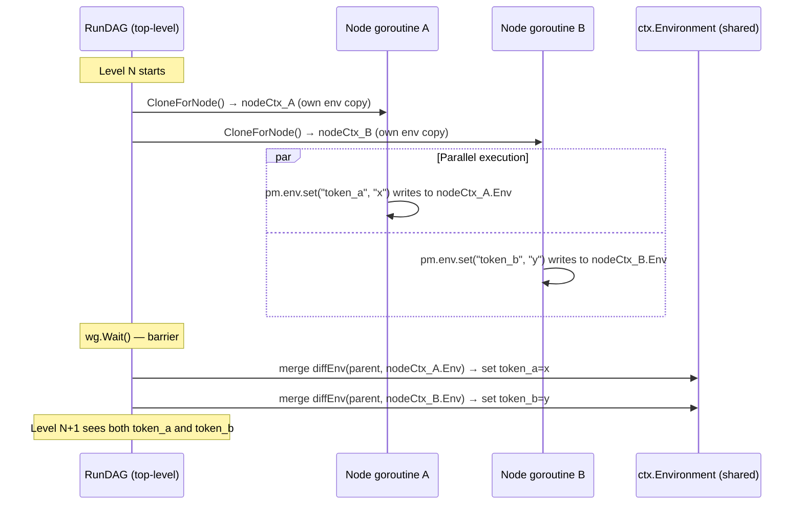
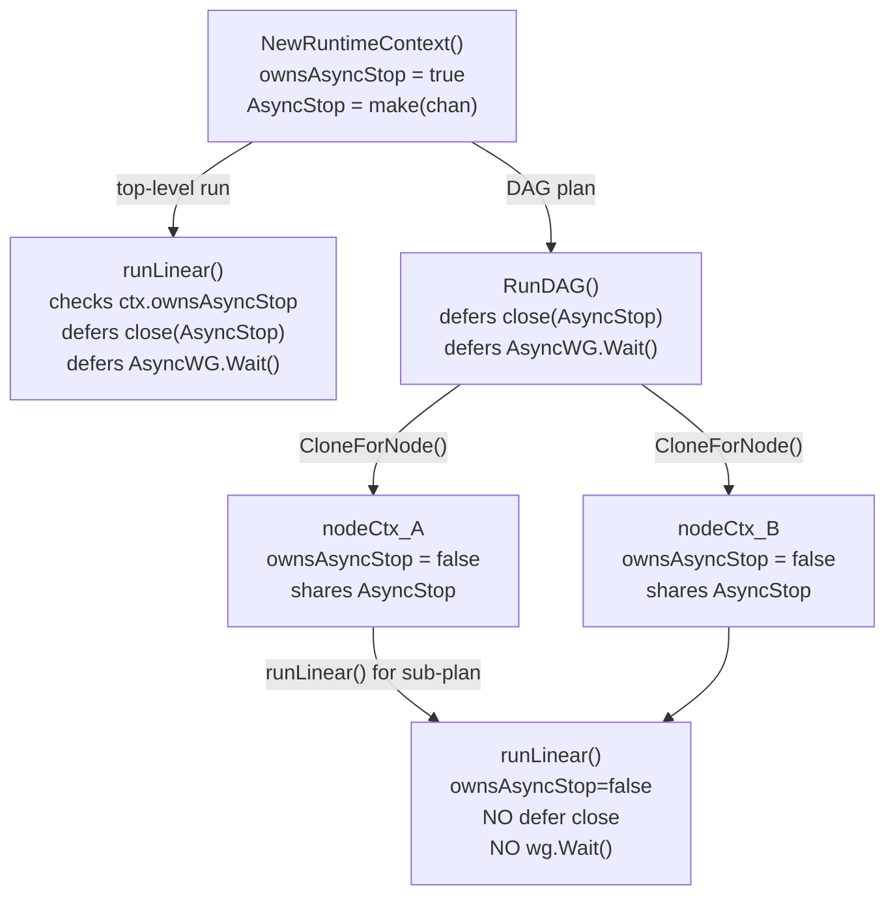
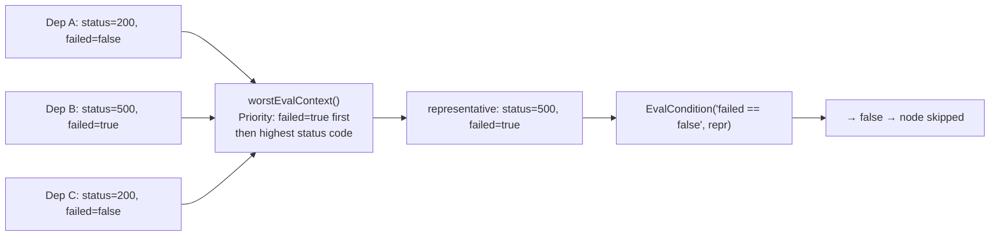
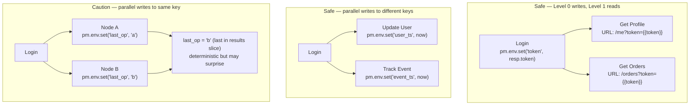

# DAG Phase 2 — Safe Environment Isolation & Env Merge

## What was broken in Phase 1

Phase 1 shipped a known race condition. Every goroutine in a DAG level shared
the same `*RuntimeContext`, meaning every goroutine wrote to the same
`Environment.Variables` map. Two parallel nodes calling `pm.env.set` at the
same time was an instant runtime panic in Go's race detector.

Phase 1 also had `IsDAGNode bool` on `ExecutionPlan` — the immutable plan was
being used to carry execution-time state. That is the wrong layer.

Phase 2 fixes both.

---

## Changes in this phase

### Files changed

| File | Change |
|---|---|
| `internal/runner/runtime_context_struct.go` | Added `ownsAsyncStop bool` field |
| `internal/runner/runtime_context_ctor.go` | `NewRuntimeContext` sets `ownsAsyncStop: true`; new `CloneForNode()` sets it `false` |
| `internal/runner/dag_runner.go` | Each node gets a `CloneForNode()` env snapshot; diffs merged after level barrier; `worstEvalContext` for condition evaluation; cleanup moved here |
| `internal/runner/collection_runner_method.go` | `runLinear` checks `ctx.ownsAsyncStop` instead of `plan.IsDAGNode` |
| `internal/planner/plan_struct.go` | Removed `IsDAGNode bool` field |

---

## Architecture: how env isolation works



The key insight: `CloneForNode` snapshots the current `Environment.Variables`
map into a fresh copy. The goroutine owns that copy exclusively — no other
goroutine touches it. After `wg.Wait()`, the diffs (new or changed keys) are
merged back sequentially with no concurrency.

---

## Architecture: ownership of AsyncStop



Before Phase 2, `IsDAGNode bool` on `ExecutionPlan` was the signal. That was
wrong: `ExecutionPlan` is immutable shared config, not execution-time state.
`ownsAsyncStop` on `RuntimeContext` is the correct location — it's mutable
per-run state.

---

## The condition evaluation fix

Phase 1 evaluated `condition` against **each** dependency independently in a
loop. For a fan-in node with 3 deps, the condition was checked 3 times:

```
// Phase 1 (buggy for fan-in)
for _, depIdx := range plan.DAG.Edges[reqIdx] {
    ok, _ := dag.EvalCondition(req.Condition, evalCtxs[depIdx])
    // checked against dep 0, then dep 1, then dep 2 independently
}
```

If dep 0 returned 200 and dep 1 returned 500, the condition `"status == 200"`
would pass for dep 0 and fail for dep 1 — but the node would run because the
loop exits on first pass. This is semantically wrong for fan-in nodes.

Phase 2 uses `worstEvalContext`:



**Rule:** any dep with `Failed=true` wins. Among all-success deps, highest
status code wins. This gives `"failed == false"` its correct semantics:
all deps must have succeeded.

---

## diffEnv — how writes are detected

```go
func diffEnv(parent, child map[string]string) map[string]string {
    diff := make(map[string]string)
    for k, v := range child {
        if parent[k] != v {
            diff[k] = v
        }
    }
    return diff
}
```

This captures both new keys (not present in parent) and changed keys (value
differs). Keys the node did not touch are not in the diff. The merge after
`wg.Wait()` applies only the diff, not the full child map, which is important
for correctness: if two nodes read and re-write the same key to the same value,
the merge is idempotent.

---

## What last-write-wins means in practice

If two nodes in the same level both write to the same key:

```json
[
  {
    "name": "Update User",
    "depends_on": ["Login"],
    "scripts": [{"type": "test", "exec": ["pm.env.set('last_op', 'update')"]}]
  },
  {
    "name": "Track Event",
    "depends_on": ["Login"],
    "scripts": [{"type": "test", "exec": ["pm.env.set('last_op', 'track')"]}]
  }
]
```

After the level barrier, `last_op` will be either `"update"` or `"track"`
depending on which goroutine's result is processed last in the sequential merge
loop. The order in the `results` slice is deterministic (it follows the level
slice order), so the outcome is reproducible for a given collection.

**Recommendation in docs:** if two parallel nodes need to write to the same key,
they should use unique key names instead.

---

## Safe vs unsafe patterns (updated)



---

## What Phase 3 will add

Phase 2 resolves the race condition. Phase 3 (Explicit Data Wiring) adds
declarative `"extract"` fields that pull values from a response body via
JSONPath without requiring JavaScript:

```json
{
  "name": "Login",
  "method": "POST",
  "url": "{{base_url}}/auth",
  "extract": {
    "token": "$.data.access_token",
    "user_id": "$.data.user.id"
  }
}
```

The extracted values are written into the node's env clone, then merged back
after the level barrier — the same mechanism Phase 2 already implements.
Phase 3 needs zero changes to the env isolation model.