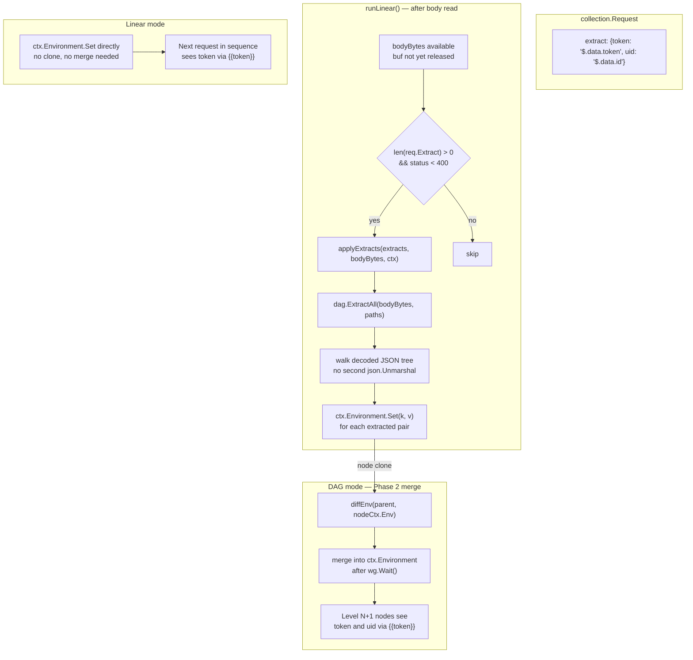
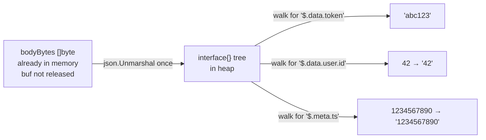
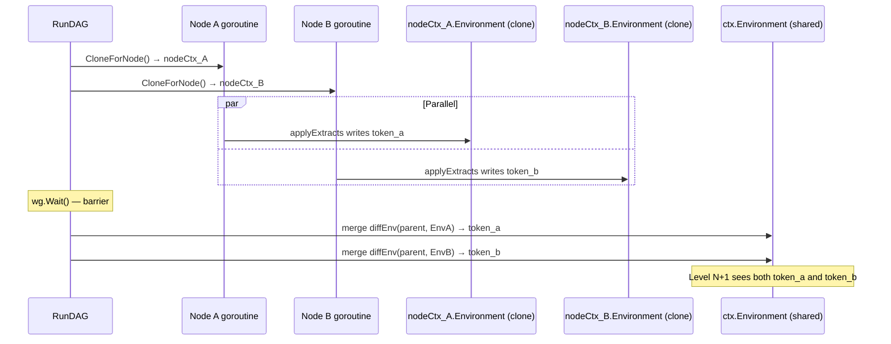

# DAG Phase 3 — Explicit Data Wiring (`extract`)

## What this phase adds

Phase 3 eliminates the most common reason people write JavaScript in a collection:
extracting a value from one response and making it available to the next request.

Before Phase 3 you had to write:
```javascript
// scripts: [{type: "test", exec: ["pm.env.set('token', pm.response.json().data.token)"]}]
```

After Phase 3 you declare it:
```json
"extract": {
  "token": "$.data.token"
}
```

The runtime does the extraction, writes the variable, and the Phase 2 env-merge
propagates it to downstream nodes automatically — zero JavaScript, zero GC from
script compilation for this use case.

---

## Files changed

| File | Change |
|---|---|
| `internal/collection/request_struct.go` | Added `Extract map[string]string` field |
| `internal/dag/extract.go` | **NEW** — zero-dependency JSONPath evaluator |
| `internal/dag/extract_test.go` | **NEW** — table-driven tests |
| `internal/runner/collection_runner_method.go` | Added `applyExtracts` call + helper |

No changes to `dag_runner.go`, `planner`, or any other file. Phase 2's env-clone
and diff-merge already handle the propagation correctly.

---

## Architecture — data flow



---

## The JSONPath evaluator — design choices

### Zero new dependencies

The `go.mod` has no JSONPath library. Adding one would bring a full runtime
dependency for what is fundamentally a tree-walk problem. The evaluator in
`internal/dag/extract.go` is ~130 lines and handles the subset of JSONPath
that covers real API responses:

```
$.key                    top-level field
$.key.nested.deep        dot-separated traversal
$.array[0]               array index
$.array[2].field         array index then field
$.array[1].nested[0]     mixed traversal
```

Full JSONPath (filters, recursive descent, wildcards) is deliberately out of
scope. If a path is too complex for the evaluator, `pm.env.set` in a script
still works.

### One decode, multiple walks



`bodyBytes` is already in `buf` (the pooled `bytes.Buffer`). The JSON is decoded
once into a generic `interface{}` tree. All path evaluations walk that single
in-memory tree. The buf is released *after* extraction completes, so there is
no double-buffering.

### Number formatting

`json.Unmarshal` decodes all JSON numbers as `float64`. The `stringify` function
converts whole-number floats to integers without a decimal point, so `42.0`
becomes `"42"` not `"42.0"`. This keeps `{{user_id}}` usable directly in URL
paths without surprises.

### GC impact

For a request with 3 extract entries and a 2KB JSON body:

| Allocation | Size | Notes |
|---|---|---|
| `interface{}` tree | ~2–4× body size | Lives only during extraction, GC'd immediately |
| `results` map | 3 entries | Returned to `applyExtracts`, then GC'd |
| Extracted strings | N strings | These persist in `ctx.Environment.Variables` — unavoidable |

The alternative (a streaming JSONPath parser) would avoid the tree allocation
but would require a full parser with its own allocations. For bodies up to a
few MB the decode-once approach is faster in practice because Go's JSON decoder
is highly optimized.

---

## Race safety analysis



`applyExtracts` writes to `ctx.Environment`, which in DAG mode is a
`CloneForNode()` copy — a private map owned by exactly one goroutine. No
locking needed. The Phase 2 merge runs sequentially after the barrier. Zero
new race surface.

In linear mode there is no concurrency at all, so writes go directly to the
shared environment safely.

---

## Example collection JSON

```json
{
  "name": "Auth + parallel data fetch",
  "requests": [
    {
      "name": "Login",
      "method": "POST",
      "url": "{{base_url}}/auth",
      "body": "{\"email\":\"{{email}}\",\"password\":\"{{password}}\"}",
      "extract": {
        "token":   "$.data.access_token",
        "user_id": "$.data.user.id"
      }
    },
    {
      "name": "Get profile",
      "method": "GET",
      "url": "{{base_url}}/users/{{user_id}}",
      "depends_on": ["Login"],
      "condition": "status == 200",
      "headers": {"Authorization": "Bearer {{token}}"}
    },
    {
      "name": "Get orders",
      "method": "GET",
      "url": "{{base_url}}/orders?uid={{user_id}}",
      "depends_on": ["Login"],
      "headers": {"Authorization": "Bearer {{token}}"}
    },
    {
      "name": "Checkout",
      "method": "POST",
      "url": "{{base_url}}/checkout",
      "depends_on": ["Get profile", "Get orders"],
      "condition": "failed == false",
      "headers": {"Authorization": "Bearer {{token}}"}
    }
  ]
}
```

Terminal output for this collection:

```
[DAG] Level 0 — 1 node(s) in parallel
[RUN] Running request: Login
Status: 200 OK  |  Time: 312ms  |  256 B received
[EXTRACT] Login → token = "eyJhbGci..."
[EXTRACT] Login → user_id = "42"

[DAG] Level 1 — 2 node(s) in parallel
[RUN] Running request: Get profile
[RUN] Running request: Get orders
Status: 200 OK  |  Time: 88ms  |  512 B received
Status: 200 OK  |  Time: 95ms  |  1024 B received

[DAG] Level 2 — 1 node(s) in parallel
[RUN] Running request: Checkout
Status: 201 Created  |  Time: 220ms  |  128 B received
```

The `token` and `user_id` from Login are available as `{{token}}` and
`{{user_id}}` in all downstream requests — no JavaScript written.

---

## Error handling

Extraction errors are non-fatal warnings. A missing key or bad path prints a
yellow warning and skips that variable; all other extractions and the request
metric continue normally.

```
⚠ [EXTRACT] Login: extract: "bad_key" → "$.data.nonexistent": key "nonexistent" not found
```

This design keeps the collection running rather than aborting on a
mis-configured path, matching how `pm.env.set` behaves in JS scripts (it
silently sets undefined if the path doesn't resolve).

---

## Supported path syntax summary

| Expression | Resolves to |
|---|---|
| `$.key` | Top-level field `key` |
| `$.a.b.c` | Nested traversal |
| `$.arr[0]` | First element of array `arr` |
| `$.arr[2].name` | Field `name` of third element |
| `$.arr[1].nested[0]` | Index into nested array |

| Type returned | Stringified as |
|---|---|
| `"hello"` | `hello` |
| `42` (integer) | `42` |
| `9.5` (float) | `9.5` |
| `true` / `false` | `true` / `false` |
| `null` | `""` (empty string) |
| `{...}` / `[...]` | JSON-encoded string |

---

## What Phase 4 will add

Phase 4 (Visual Graph Editor) will render the DAG as a canvas in the embedded
UI. The `extract` field integrates naturally: an edge between nodes can show
which variables are wired (e.g., "Login → Get Profile via {{token}}") because
the information is already declared in the JSON.

No changes to `extract.go` or the runner will be needed for Phase 4.