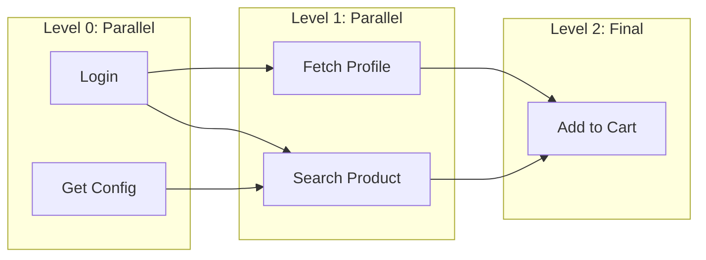

# 🕸️ Proposal: Scenario Graphs & DAG-based Execution

This document outlines the architectural shift from linear (sequential) request execution to a **Directed Acyclic Graph (DAG)** model. This is the next major evolution of ReqX, enabling high-performance parallel execution and complex workflow dependencies.

---

## 🚀 The Core Vision
Currently, ReqX executes requests in a fixed sequence (1 → 2 → 3). With DAG support, ReqX will resolve **dependencies** between requests. Requests with no dependencies run in parallel, while dependent requests wait for their prerequisites.

### Why this matters:
- **Performance**: Parallel execution of independent requests can reduce total test duration by 50-70%.
- **Complex Logic**: Handle scenarios like "Wait for Login *then* run Search and Checkout in parallel."
- **Efficiency**: Conditional skipping of downstream requests if a prerequisite fails.

---

## 🏗️ Execution Model: Parallel Levels

The execution engine uses **Topological Sorting** (Kahn's Algorithm) to group requests into "Levels."

**Execution Flow:**
1.  Launch all nodes in **Level 0** concurrently using `sync.WaitGroup`.
2.  Wait for all Level 0 nodes to complete.
3.  Launch all nodes in **Level 1** concurrently.
4.  Repeat until the entire graph is processed.

---

## 🛠️ Implementation Blueprint

### 1. New Components (`internal/dag/`)
| File | Responsibility |
| :--- | :--- |
| `graph.go` | Data structure for nodes and edges. |
| `topo.go` | Kahn's algorithm for topological sorting and cycle detection. |
| `condition_eval.go` | Logic for evaluating `"condition": "status == 200"` edges. |
| `../runner/dag_runner.go` | The concurrent executor that handles the levels and WaitGroups. |

### 2. Required Modifications
- **`internal/collection/request_struct.go`**: Add `DependsOn []string` and `Condition string` to the request model.
- **`internal/planner/planner_method.go`**: Detect dependencies; if found, build and validate the DAG.
- **`internal/runner/collection_runner_method.go`**: Check if the plan contains a DAG; if so, delegate to `dag_runner.RunDAG()`.

---

## 📅 Roadmap: 4 Phases of Implementation

### Phase 1: Parallel Core (Complexity: Low | Value: High)
- Implement `depends_on` in JSON.
- Build topological sorter and parallel level runner.
- **Goal:** Immediate speed boost via concurrency.

### Phase 2: Conditional Edges (Complexity: Medium)
- Add edge logic: `"condition": "status == 200"`.
- Support skipping nodes if dependencies don't meet criteria.

### Phase 3: Explicit Data Wiring (Complexity: Medium)
- Add `"extract": {"user_id": "$.data.id"}` to nodes.
- Reduces reliance on JavaScript for simple value chaining.

### Phase 4: Visual Graph Editor (Complexity: High)
- Add a canvas to the embedded UI.
- Drag-and-drop request orchestration.

---

## 💡 Key Design Constraint
**Topological levels are mandatory.** A flattened list is insufficient because it loses parallelism. We must return a `[][]int` where each sub-slice represents a tier of safe-to-parallelize nodes.

---
*Status: Proposed for VNext*
