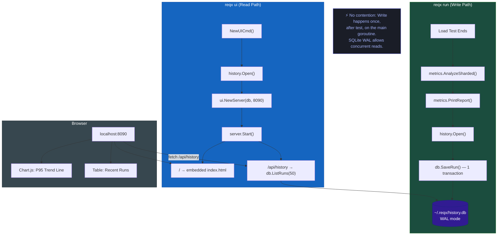

# Architecture: Local History & Embedded UI

## Package Structure

| Package | Files | Purpose |
| :--- | :--- | :--- |
| `internal/history` | `db_struct.go`, `db_ctor.go`, `db_method.go`, `db_query_method.go` | SQLite open/migrate, write (SaveRun), read (ListRuns) |
| `internal/ui` | `embed.go`, `server_struct.go`, `server_ctor.go`, `server_method.go`, `assets/index.html` | HTTP server, embedded assets, browser launch |
| `cmd` | `ui_cmd_ctor.go` | `reqx ui` Cobra command |

## No-Contention Guarantee

The `history.SaveRun()` is called **once per test**, synchronously, on the main goroutine, **after** `PrintReport()` completes. SQLite WAL mode means the `reqx ui` server can read the DB while a test is running without any locking contention.
