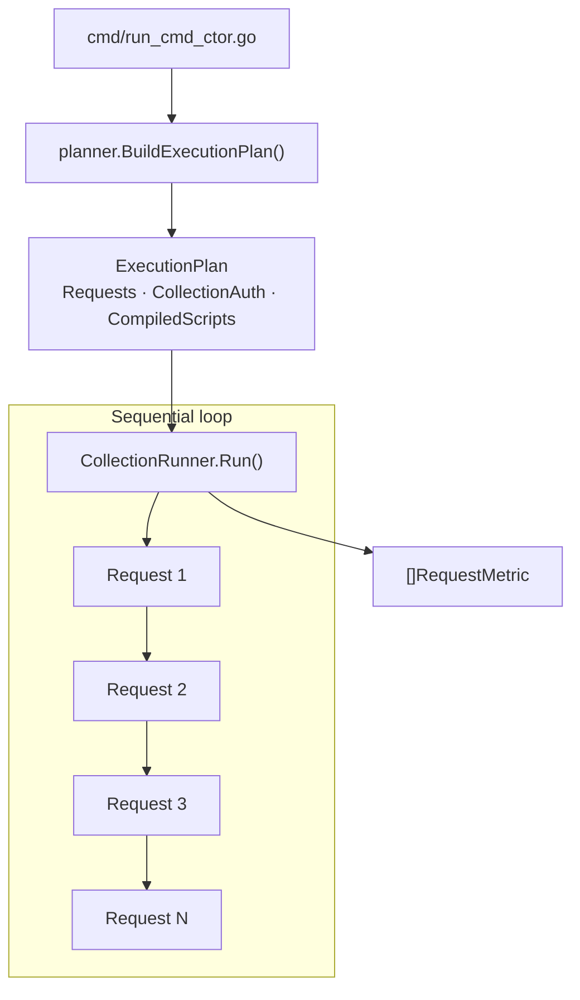
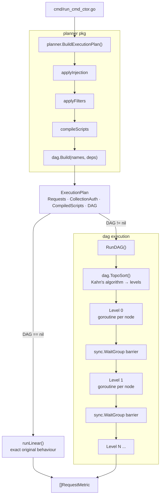
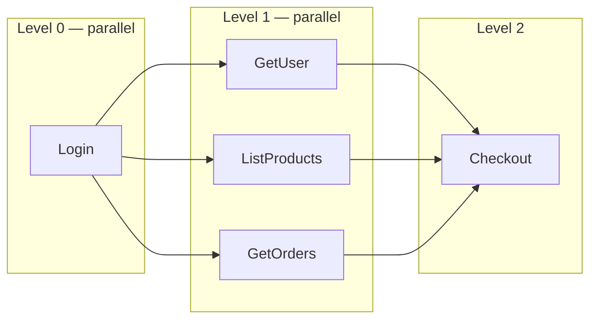
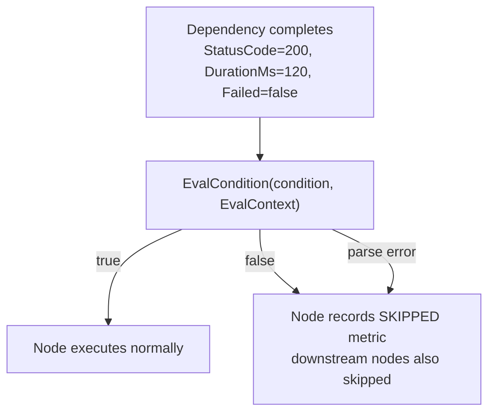

# DAG Execution — Implementation Notes

## What changed and why

ReqX previously executed every request in strict sequential order. Every request
waited for the one before it, even when they had no logical dependency on each
other. This left parallelism on the table for any collection where multiple
independent requests could be issued simultaneously.

The change introduces an optional **scenario graph** (DAG — Directed Acyclic
Graph) that lets users declare `depends_on` relationships between requests. The
planner builds the graph at plan time, topologically sorts it into execution
levels, and the runner dispatches each level in parallel. Collections without
any `depends_on` fields are completely unaffected — the graph is `nil` and the
original linear path runs unchanged.

---

## Files changed

### New files

| File | Purpose |
|---|---|
| `internal/dag/graph.go` | `ScenarioGraph` struct and `Build()` constructor |
| `internal/dag/topo.go` | Kahn's topological sort → `[][]int` levels |
| `internal/dag/condition_eval.go` | Condition expression evaluator |
| `internal/runner/dag_runner.go` | Parallel level-by-level execution engine |

### Modified files

| File | What changed |
|---|---|
| `internal/collection/request_struct.go` | Added `DependsOn []string` and `Condition string` |
| `internal/planner/plan_struct.go` | Added `DAG *dag.ScenarioGraph` to `ExecutionPlan` |
| `internal/planner/planner_method.go` | Calls `dag.Build()` after `compileScripts` |
| `internal/runner/collection_runner_method.go` | `Run()` dispatches to `RunDAG` when `plan.DAG != nil` |

---

## Architecture — before



Every request runs after the previous one, regardless of whether there is any
data dependency between them.

---

## Architecture — after



---

## Data flow through the DAG package

```mermaid
flowchart LR
    RS["collection.Request\n+ DependsOn\n+ Condition"]
    RS --> Build["dag.Build(names, deps)"]
    Build --> Graph["ScenarioGraph\nNodes · Edges · nameToIndex"]
    Graph --> Topo["dag.TopoSort()"]
    Topo --> Levels["[][]int — levels\ne.g. [[0],[1,2],[3]]"]

    Levels --> RunDAG["RunDAG()"]
    RunDAG --> Eval["dag.EvalCondition()\nstatus == 200\nduration_ms < 500\nfailed == false"]
    Eval --> SubPlan["single-element sub-plan\nreuses cr.Run()"]
    SubPlan --> Metric["RequestMetric"]
    Metric --> EvalCtx["dag.EvalContext\nfor downstream conditions"]
```



---

## How topological sort produces parallel levels

Given this collection:

```
Login  →  GetUser
Login  →  ListProducts
Login  →  GetOrders
GetUser + ListProducts + GetOrders  →  Checkout
```

Kahn's algorithm produces:



Wall time drops from `sum of all durations` to `sum of the critical path` (the
longest chain of sequential dependencies).

---

## Condition evaluation

A node can guard itself with a `condition` expression checked against the result
of its last declared dependency:

```
"status == 200"      — only run if dep returned HTTP 200
"status >= 200"      — run if dep returned any 2xx/3xx
"duration_ms < 500"  — only run if dep was fast
"failed == false"    — skip if dep errored or returned 4xx/5xx
```



An empty `condition` string always passes — nodes without a condition run
whenever their dependencies finish.

---

## Backward compatibility

The `DAG` field on `ExecutionPlan` is a pointer and defaults to `nil`. The
`Run()` method on `CollectionRunner` checks this pointer first:

```go
func (cr *CollectionRunner) Run(plan *planner.ExecutionPlan, ctx *RuntimeContext) ([]RequestMetric, error) {
    if plan.DAG != nil {
        return cr.RunDAG(plan, ctx)
    }
    return cr.runLinear(plan, ctx)
}
```

A collection JSON without any `depends_on` fields produces a `nil` graph from
`dag.Build`, which produces a `nil` `DAG` field on the plan, which means `Run`
calls `runLinear` — the original unmodified code path. Zero behaviour change.

---

## Example collection JSON

```json
{
  "name": "Checkout flow",
  "requests": [
    {
      "name": "Login",
      "method": "POST",
      "url": "{{base_url}}/auth",
      "body": "{\"email\":\"{{email}}\",\"password\":\"{{password}}\"}"
    },
    {
      "name": "Get user",
      "method": "GET",
      "url": "{{base_url}}/me",
      "depends_on": ["Login"],
      "condition": "status == 200"
    },
    {
      "name": "List products",
      "method": "GET",
      "url": "{{base_url}}/products",
      "depends_on": ["Login"]
    },
    {
      "name": "Get orders",
      "method": "GET",
      "url": "{{base_url}}/orders",
      "depends_on": ["Login"]
    },
    {
      "name": "Checkout",
      "method": "POST",
      "url": "{{base_url}}/checkout",
      "depends_on": ["Get user", "List products", "Get orders"],
      "condition": "failed == false"
    }
  ]
}
```

Running this with `reqx run checkout.json -e env.json` produces:

```
[DAG] Level 0 — 1 node(s) running in parallel
[RUN] Running request: Login
Status: 200 OK  |  Time: 380ms  |  842 B received

[DAG] Level 1 — 3 node(s) running in parallel
[RUN] Running request: Get user
[RUN] Running request: List products
[RUN] Running request: Get orders
...

[DAG] Level 2 — 1 node(s) running in parallel
[RUN] Running request: Checkout
...
```

---

## Error cases

| Situation | Behaviour |
|---|---|
| `depends_on` names a request that does not exist | `BuildExecutionPlan` returns an error before any request runs |
| `depends_on` creates a cycle (A→B→A) | `TopoSort` returns a descriptive error listing the involved nodes |
| `condition` has invalid syntax | Node is skipped; error is printed; downstream nodes are also skipped |
| A dependency returns HTTP 4xx | `EvalContext.Failed = true`; condition `"failed == false"` causes skip |

---

## Trade-offs

**Shared `RuntimeContext` across parallel nodes.** Within a single DAG level,
multiple goroutines call `cr.Run` with the same `*RuntimeContext`. The
`Environment.Variables` map is written by `pm.env.set` inside test scripts.
Concurrent writes to the same map are a data race.

This is acceptable for Phase 1 because the most common pattern is:
- Level 0 (Login) writes `token` to the environment.
- Level 1 nodes only *read* `token` via `{{token}}`.

If two Level 1 nodes both run `pm.env.set` on the same key, the result is
non-deterministic. The fix is to give each goroutine a shallow copy of the
environment and merge writes back after the level completes. That is planned
but deferred — it requires deciding merge semantics (last-write-wins vs. error
on conflict).

**Condition applies to the last declared dependency only.** When a node lists
multiple `depends_on` entries, the `condition` is evaluated against each one in
order; the first failure causes a skip. Future work could allow per-edge
conditions via a `"depends_on": [{"name": "Login", "condition": "status == 200"}]`
syntax.

---

## Future extensions this design supports

- **Per-edge conditions** — replace `[]string` in `DependsOn` with a struct
  carrying both a name and a condition. No changes needed outside `graph.go`
  and `dag_runner.go`.
- **Retry nodes** — a node with `"retry": 3` could re-run itself up to N times
  before marking itself failed. `RunDAG` already owns the execution loop where
  this logic would live.
- **Environment merge after parallel level** — collect per-goroutine environment
  diffs and apply them to the shared context after `wg.Wait()`. No structural
  changes needed.
- **Visual DAG in the UI** — `ScenarioGraph.Nodes` and `ScenarioGraph.Edges` are
  plain Go maps that JSON-serialise directly. The existing history API could
  expose the graph alongside run statistics.