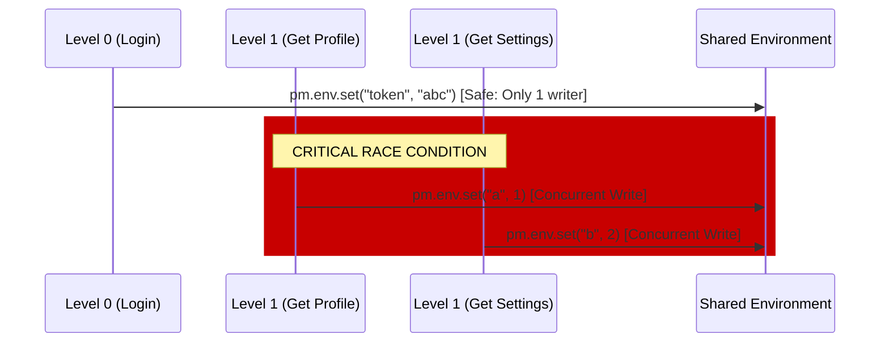

# ⚠️ Critical DAG Pitfall: Concurrent State Management

This document explains a known race condition in the Phase 1 implementation of the Scenario Graph (DAG) executor.

## 🏁 The Problem: Concurrent `pm.env.set`

In a DAG execution, all requests within the same **topological level** run concurrently using Go's goroutines.

### The Race Condition
Each of these parallel nodes shares the same `*RuntimeContext` and, crucially, the same `Environment.Variables` map. In Go, **concurrent writes to the same map are not thread-safe** and will cause a runtime panic.



---

## ✅ Safe Pattern (Common)
The most common pattern is **Level 0 writes, Level 1+ reads**. This is perfectly safe.

1.  **Level 0 (e.g., Login)**: One node writes the `token`.
2.  **Level 1 (e.g., Parallel API Calls)**: Multiple nodes *read* the `token` using `{{token}}` in their URLs or headers.
3.  **Why it works**: Reading from a map concurrently is safe as long as no other goroutine is writing to it.

---

## ❌ Unsafe Pattern (Dangerous)
Any pattern where two or more requests in the same `depends_on` tier try to update environment variables.

```json
{
  "requests": [
    {
      "name": "Update User",
      "depends_on": ["Login"],
      "scripts": [{ "type": "test", "content": "pm.env.set('last_update', Date.now())" }]
    },
    {
      "name": "Track Analytics",
      "depends_on": ["Login"],
      "scripts": [{ "type": "test", "content": "pm.env.set('last_ping', Date.now())" }]
    }
  ]
}
```
In the example above, **Update User** and **Track Analytics** are in the same level and will both try to write to the environment at the same time.

---

## 🛠️ Planned Mitigation (Phase 2)
To resolve this, we will update `RunDAG` to:
1.  Provide each node with a **shallow clone** of the environment variables.
2.  Each node writes to its own local clone.
3.  The executor collects the "diffs" from each node after `wg.Wait()`.
4.  The executor merges the diffs back into the main environment sequentially.

### Merge Strategy Ideas:
- **Last Write Wins**: Any overlapping keys will take the value of the last node completed.
- **Conflict Error**: Fail the test if two parallel nodes attempted to write to the exact same key.

---
> [!IMPORTANT]
> Until Phase 2 is implemented, ensure that only one node in any given dependency tier performs variable writes, or ensure that parallel nodes only perform reads.
