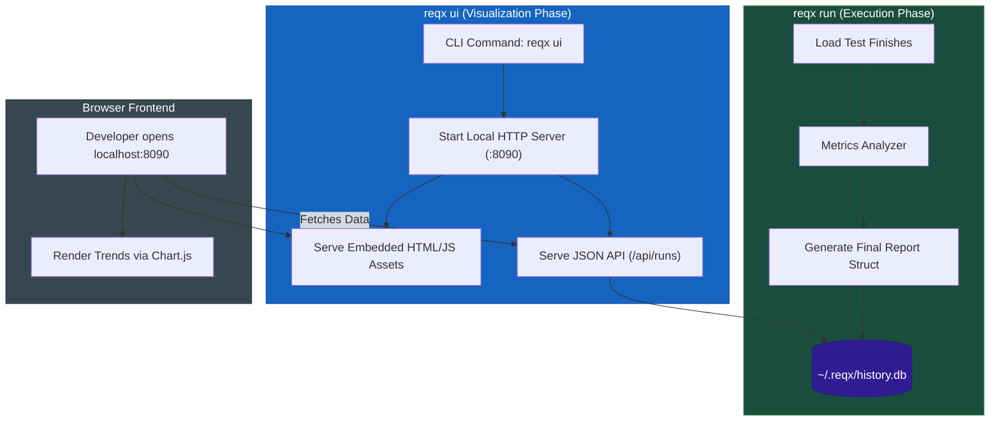

# 📊 Architecture: Local History & Embedded UI

> [!NOTE]
> This document outlines the strategy for implementing persistent local tracking and a web-based dashboard directly within the `reqx` binary.

## 1. The Problem: Ephemeral Metrics
Currently, `reqx` provides a world-class terminal report at the end of a load test. However, once the terminal is cleared, the data is gone. 

For performance engineering, **trends matter more than point-in-time results**. Developers need to answer:
*   *"Did my recent database index PR improve the P95 latency compared to yesterday's run?"*
*   *"Has the error rate on the Checkout API degraded over the last 10 builds?"*

Setting up Prometheus, Grafana, or InfluxDB for local development is often overkill.

---

## 2. The Solution: Embedded SQLite + Single-Binary UI
We will introduce a local tracking system that requires **zero setup** from the user. 

By leveraging Go's `database/sql` (with a pure-Go SQLite driver) and `//go:embed`, we can bake a complete database and a beautiful web dashboard directly into the `reqx` executable.

### Core Philosophy
*   **Single Binary:** No external dependencies or databases required.
*   **Zero Config:** Works out of the box with `~/.reqx/history.db`.
*   **Performance First:** Zero overhead during the actual load test execution.

---

## 3. Architecture Overview

> [!IMPORTANT]
> **The "Golden Rule" of Data Ingestion:** DO NOT store raw request logs. 
> To maintain high throughput (10k+ RPS), we only store the **final aggregated summary** once the test completes.

---

## 4. Database Schema Design

### Table: `test_runs`
| Field | Type | Description |
| :--- | :--- | :--- |
| `id` | UUID | Primary Key |
| `timestamp` | DATETIME | When the test occurred |
| `collection_name`| TEXT | Name of the Postman collection |
| `total_requests` | INTEGER | Total count of requests sent |
| `rps` | REAL | Average Requests Per Second |
| `p95_ms` | INTEGER | Global P95 Latency |
| `error_pct` | REAL | Global Error Percentage |

### Table: `request_stats`
*Links to `test_run.id` to provide per-endpoint trends.*
*   `run_id` (FK)
*   `request_name` (e.g., "1. Login API")
*   `successes`, `failures`
*   `p95_ms`, `avg_ms`, `max_ms`

---

## 5. Implementation Roadmap

### Phase 1: The Silent Saver
1.  **CGO-free Driver:** Use `modernc.org/sqlite` to keep `reqx` cross-compilable without GCC requirements.
2.  **Schema Migration:** Automated table creation if `~/.reqx/history.db` is missing.
3.  **Post-Run Hook:** In `cmd/run_cmd_ctor.go`, trigger `SaveToLocalDB(report)` as a background task after the terminal report is printed.

### Phase 2: The Embedded Dashboard
1.  **Tech Stack:** Vanilla JS + TailwindCSS (via CDN) + Chart.js.
2.  **`//go:embed`:** Package all frontend assets into the `internal/ui` folder.
3.  **API Layer:** Implement `/api/history` returning past 50 runs sorted by timestamp.

### Phase 3: The `reqx ui` Command
1.  Create `cmd/ui_cmd_ctor.go` to register the `ui` command.
2.  Open the browser automatically using `pkg/browser` utility.
3.  Implement basic filtering (Filter by Collection, Filter by Date).

---

## 6. Social Proof Angle (Social Media 🚀)
When this feature goes live, it's a perfect story for GitHub/LinkedIn/X:

*"How we added built-in observability to a Go CLI without bloated sidecars or Docker."*
*   **Focus:** Avoiding SQLite write-lock bottlenecks by sharding metrics in RAM and flushing once.
*   **Focus:** Single-binary distribution with `go:embed`.
*   **Result:** Instant historical trend analysis for any developer.