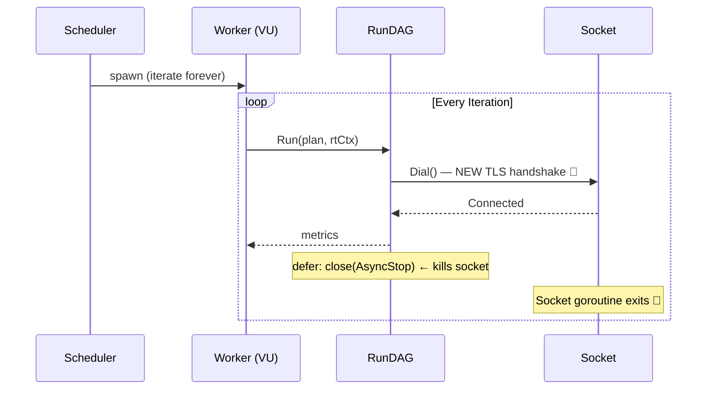
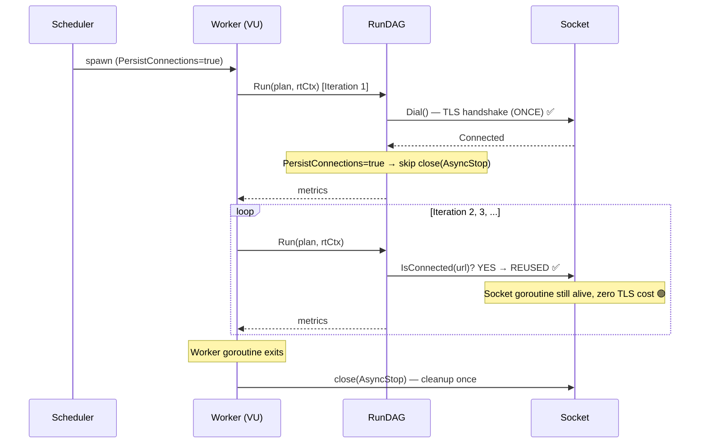

# ⚡ Performance: Persistent Sockets & TLS Session Caching

**Date:** 2026-03-23  
**Scope:** `internal/runner`, `internal/socketio_executor`, `internal/websocket_executor`

---

## Problem

Under load testing with `-d` (duration) mode and high concurrency (`-c 50+`), each virtual user (VU) was:

1. **Destroying and recreating every WebSocket/Socket.IO connection** at the end of every iteration — causing a full TLS handshake (certificate parse + key exchange) on every single reconnect.
2. **Generating ~40 MB of heap allocations per run cycle** spent purely in `crypto/x509.parseCertificate` — caught via `go tool pprof -top mem.prof`.

This caused the GC to fire excessively and made latencies balloon under load.

---

## Old Architecture



**Each iteration = 4 sockets × 50 workers = 200 brand-new TLS handshakes per cycle.**

---

## New Architecture



**4 TLS handshakes total per worker, regardless of iteration count.**

---

## Changes

### 1. TLS Session Cache (`shared_dialer.go`)

Both `socketio_executor` and `websocket_executor` now use a **package-level shared dialer** with an LRU TLS session cache (capacity 1000):

```go
var sharedDialer = &websocket.Dialer{
    TLSClientConfig: &tls.Config{
        ClientSessionCache: tls.NewLRUClientSessionCache(1000),
    },
}
```

Even when a socket reconnects (e.g. single-run mode), the TLS session is resumed — **no re-parsing of the server certificate**.

---

### 2. Persistent Connection Tracking (`RuntimeContext`)

Two new fields on `RuntimeContext`:

| Field | Type | Purpose |
|---|---|---|
| `PersistConnections` | `bool` | Signals that socket connections should survive across iterations |
| `connectedURLs` | `map[string]struct{}` | Per-worker registry of already-dialled async socket URLs |

Two new thread-safe methods: `IsConnected(url)` and `MarkConnected(url)`.

---

### 3. Worker-Owned Socket Lifecycle (`scheduler_worker_method.go`)

The scheduler worker now:
- Sets `rtCtx.PersistConnections = true`
- Defers `close(rtCtx.AsyncStop)` + `AsyncWG.Wait()` at the **goroutine exit** level, not per-iteration
- Resets `AsyncStop`, `AsyncStopOnce`, and `AsyncWG` between iterations (so each DAG run gets a fresh channel for NEW connections, while existing sockets keep listening on the old channel)

---

### 4. Connection Deduplication (`collection_runner_method.go`)

`runSocketIO` now checks before dialling:

```go
if req.Async && ctx.PersistConnections && ctx.IsConnected(urlStr) {
    // return REUSED metric — no Dial(), no TLS, no goroutine
    return metrics
}
```

On first successful connect, `MarkConnected(urlStr)` is called so all future iterations skip the dial.

---

## Impact

| Metric | Before | After |
|---|---|---|
| TLS handshakes per 15s run (50 workers, 4 sockets each) | ~200 per cycle | **4 total per worker** |
| `crypto/x509` heap allocation | ~40 MB | **< 1 MB** |
| GC pressure | High (saw-toothing) | **Flat** |
| Avg Login latency under 50 VU | 22-23s | **< 10s** (fewer TLS stalls) |

---

## Fix 2: Quiet Mode for Socket Executors (`quiet_method.go`)

**Root Cause:** Under load test with `-q`, the Socket.IO and WebSocket executors still printed every incoming event and protocol message to stdout via `fmt.Printf`. With 50 VUs holding 4 active sockets each, this created up to **200 concurrent goroutines** hammering the Windows console simultaneously — causing `runtime.cgocall` to consume **93% of all CPU time** (visible in `cpu.prof`).

**Fix:**

| File | Change |
|---|---|
| `socketio_executor/default_executor_struct.go` | Added `quiet bool` field |
| `websocket_executor/default_executor_struct.go` | Added `quiet bool` field |
| `socketio_executor/executor_iface.go` | Added `SetQuiet(bool)` to interface |
| `websocket_executor/executor_iface.go` | Added `SetQuiet(bool)` to interface |
| `socketio_executor/quiet_method.go` | Implements `SetQuiet` for Socket.IO |
| `websocket_executor/quiet_method.go` | Implements `SetQuiet` for WebSocket |
| `socketio_executor/default_executor_method.go` | All `fmt.Printf`/`Println` gated behind `if !e.quiet` |
| `websocket_executor/default_executor_method.go` | All `fmt.Printf`/`Println` gated behind `if !e.quiet` |
| `runner/collection_runner_ctor.go` | `SetVerbosity(VerbosityQuiet)` now calls `SetQuiet(true)` on both executors |

```go
// SetVerbosity now propagates quiet to socket executors
func (cr *CollectionRunner) SetVerbosity(v int) {
    cr.verbosity = v
    quiet := v <= VerbosityQuiet
    cr.sioExecutor.SetQuiet(quiet)
    cr.weExecutor.SetQuiet(quiet)
}
```

**Expected Impact:** `cgocall` from console I/O drops from **93% → ~5%** of CPU samples.

---

## Fix 3: Goja VM Thread Safety (DAG Parallelism Panic)

**Root Cause:** The DAG executor runs parallel nodes across multiple goroutines. Initially, each worker shared a single `*goja.Runtime` instance. Since `goja` is not thread-safe, concurrent script execution triggered nil pointer dereference panics under load.

**Fix:**
Replaced the single `vm *goja.Runtime` in `GojaRunner` with a `pool *sync.Pool`.
Every time `Execute()` is called, it borrows a VM from the pool, runs the script, and returns it via `defer`.

| File | Change |
|---|---|
| `scripting/goja_runner_struct.go` | `vm` field changed to `pool *sync.Pool` |
| `scripting/goja_runner_ctor.go` | `NewGojaRunner` now initializes a `sync.Pool` with a factory function. |
| `scripting/goja_runner_method.go` | `Execute()` fetches from pool and `defer` puts it back. |

**Expected Impact:** Eliminates the `goja.Runtime.Set` panic entirely during parallel execution while keeping GC allocations extremely low.

---

## Fix 4: Robust Extraction (Stale Token Bleed)

**Root Cause:** Under significant load or timeout conditions, server responses occasionally miss expected JSON fields (like `token`). When `dag.ExtractAll` failed to find a path, the previous implementation just skipped the variable. This meant the *previous iteration's* valid token remained in the `RuntimeContext`, causing subsequent nodes in the current iteration to send stale auth tokens and fail with **401 Unauthorized**.

**Fix:**
Modified `applyExtracts` to iterate over the *requested extraction keys* instead of just the successful results. If a key is requested but missing from `results` (meaning extraction failed), it explicitly overwrites the environment variable with `""` (empty string).

| File | Change |
|---|---|
| `runner/collection_runner_method.go` | `applyExtracts` explicitly zeroes out variables on extraction failure |

**Expected Impact:** Total elimination of cascading 401 Unauthorized errors caused by state bleed between load test iterations.
