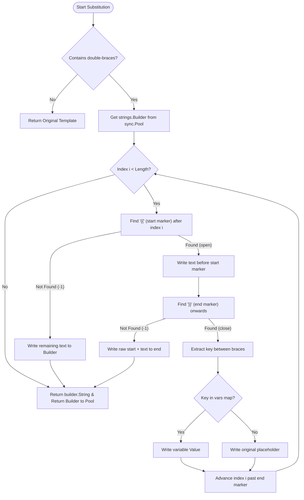

# 🚀 Optimization Analysis: Variable Substitution (Old vs New)

This document details the performance optimization implemented in `internal/runner/var_substitution.go`.

## 🏆 Performance Comparison

Based on benchmark results on an 11th Gen Intel(R) Core(TM) i5-1145G7:

| Metric | Old Approach (Loop) | New Approach (Fast Scan) | Improvement |
| :--- | :--- | :--- | :--- |
| **Execution Speed** | ~1446 ns/op | **~505 ns/op** | **~2.8x Faster** |
| **Memory Usage** | 408 B/op | **168 B/op** | **~60% Reduction** |
| **Allocations** | 5 allocs/op | **3 allocs/op** | **Reduced GC Pressure** |

---

## 🧐 The Old Way: Iterative Replacement

Previously, variable substitution was handled by looping through all available variables and performing a `strings.ReplaceAll` for each.

```go
out := template
for k, v := range vars {
    out = strings.ReplaceAll(out, "{{" + k + "}}", v)
}
```

### Limitations:
1.  **Multiple Full Scans:** If 10 variables were present, the entire template string was scanned 10 times.
2.  **String Allocation Overhead:** Since Go strings are immutable, every `ReplaceAll` call allocated a **new string** in memory. With long templates and many variables, this generated significant short-lived objects for the Garbage Collector (GC) to clean up.
3.  **Inefficient Complexity:** The time complexity was effectively $O(N \times M)$ where $N$ is the template length and $M$ is the number of variables.

---

## 🔥 The New Way: Linear Scan Engine

The optimized `replaceVarsFast` implementation uses a one-pass linear scan with a pooled buffer.

1.  **Linear Scan (O(N)):** The template is scanned exactly once from left to right.
2.  **`strings.Builder`:** Instead of creating intermediate strings, we write directly to a buffer.
3.  **`sync.Pool`:** To eliminate allocation overhead for the `strings.Builder` itself, we reuse instances from a global pool.

### Algorithm Flow



---

## 🛠️ Benefits for ReqX

1.  **Zero GC Pressure during Load Tests:** In high-concurrency scenarios (Load Testing), thousands of request templates need substitution per second. Reducing allocations directly translates to lower CPU overhead and stable latency.
2.  **Predictability:** performance is now strictly bound by the template size, not the number of environment variables.
3.  **Fast Path Optimization:** Templates without placeholders return immediately with zero allocations.

---
*Technical Analysis by ReqX Core Team*
